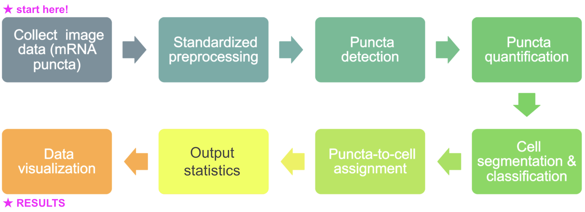
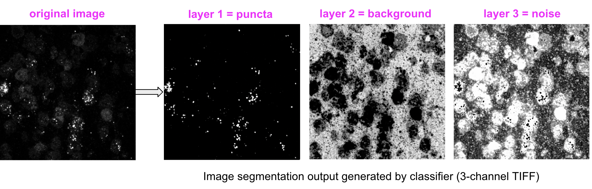
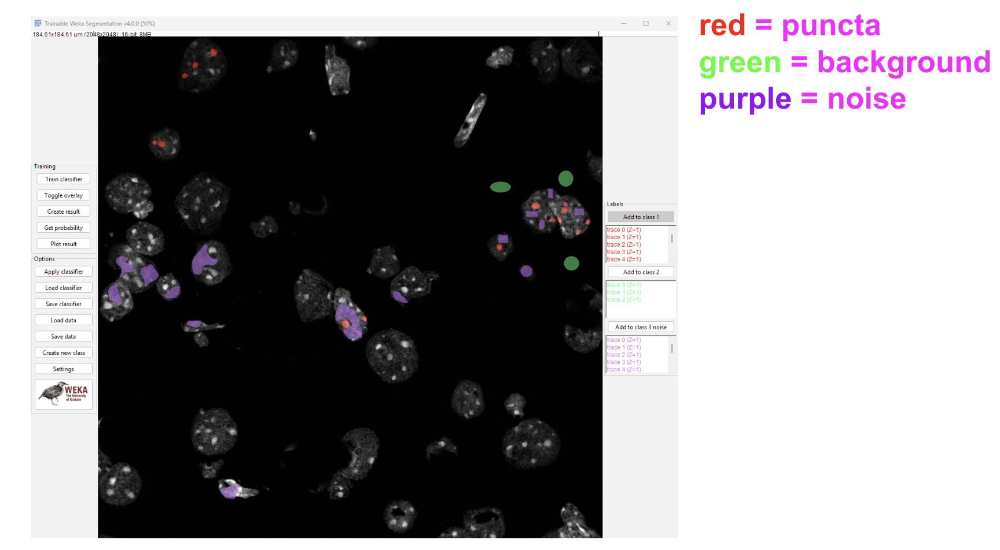
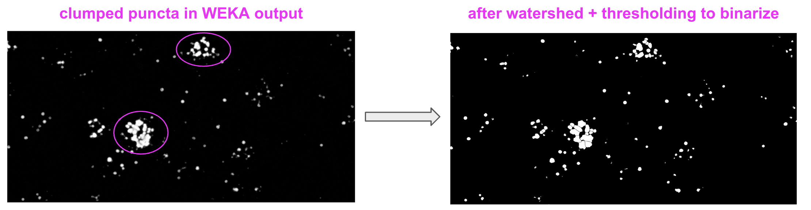
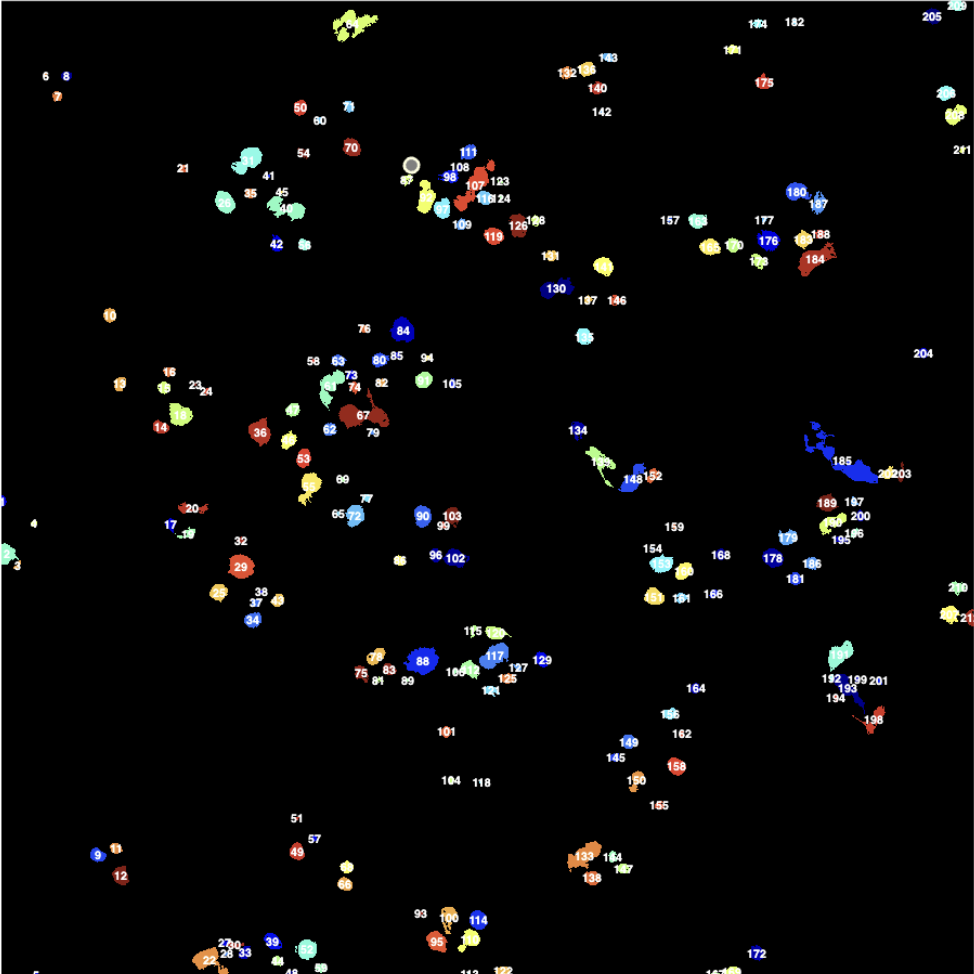
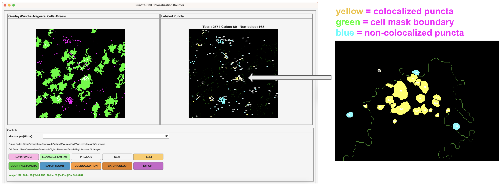
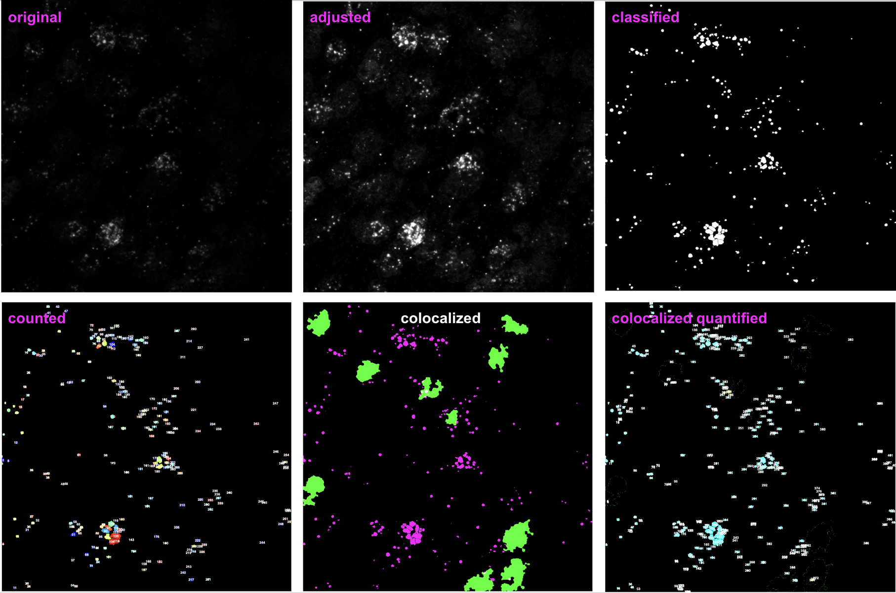

# An open-source image analysis pipeline for single-cell mRNA puncta quantification and colocalization
This repository provides a reproducible, batch-analysis pipeline for quantifying mRNA puncta in confocal microscopy images, designed for experiments with excitatory (VGLUT) and inhibitory (GAD) neuron cell-type masks. The pipeline enables accurate detection, segmentation, and per-cell analysis of mRNA puncta, facilitating high-throughput analysis of RNAscope datasets.

  

## WEKA Trainable Classifier Integration (FIJI)
The FIJI Trainable Weka Segmentation (TWS) plugin integrates the image-processing framework of FIJI with the machine learning algorithms of WEKA to enable supervised and unsupervised image segmentation. Using a limited set of user-provided pixel annotations, TWS extracts multiscale image features and trains a classifier that can be interactively refined to segment complex biological images.

  

The classifier model in this repository was trained on ~15 INHBA mRNA puncta images with 3 training (or classification) labels: puncta, background (black), and noise.

  

**Post-processing of WEKA classification results (batch)**

Apply *watershed* to segment clumps of detected puncta (in FIJI: Process -> Binary -> Watershed, or use a .macro automation for a folder of images). Before applying the watershed, ensure the output is binarized (in FIJI: Image -> Threshold -> B&W). 

  

## Custom MATLAB GUI for quantification & colocalization metrics
* Creates count masks for puncta quantification and exports numeric data (CSV), including puncta area and total count per image.

  

* Loads folders of excitatory (VGLUT) and inhibitory (GAD) masks to compute colocalization metrics per cell, including mean puncta per cell, # non-coloc puncta, density, etc.

  

* Designed for **batch analysis**! Process large datasets of images reproducibly and efficiently using the "batch count" / "batch coloc" buttons. 

## EXAMPLE WORKFLOW

  

