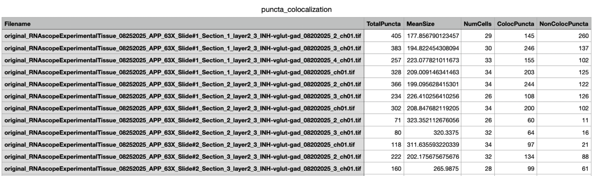
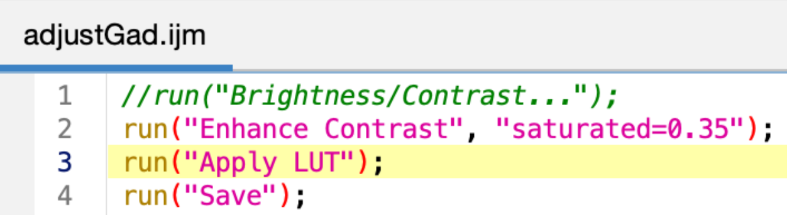
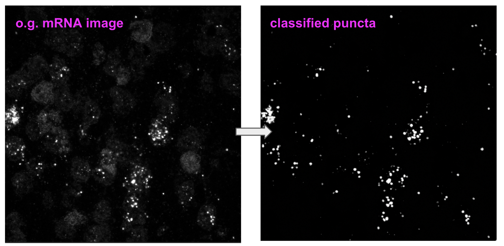

# An open-source image analysis pipeline for single-cell mRNA puncta quantification and colocalization
This repository provides a reproducible, batch-analysis pipeline for quantifying mRNA puncta in confocal microscopy images, designed for experiments with excitatory (VGLUT) and inhibitory (GAD) neuron cell-type masks. The pipeline enables accurate detection, segmentation, and per-cell analysis of mRNA puncta, facilitating high-throughput analysis of RNAscope datasets.

  

## WEKA Trainable Classifier Integration (FIJI)
The FIJI Trainable Weka Segmentation (TWS) plugin integrates the image-processing framework of FIJI with the machine learning algorithms of WEKA to enable supervised and unsupervised image segmentation. Using a limited set of user-provided pixel annotations, TWS extracts multiscale image features and trains a classifier that can be interactively refined to segment complex biological images.

  

The classifier model in this repository ( [Google Drive download link](https://drive.google.com/file/d/1DyxPmiG2cWH34HeAA1bCvjoVOSbJI5gX/view?usp=sharing) ) was trained on ~15 INHBA mRNA puncta images with 3 training (or classification) labels: puncta, background (black), and noise.

  

**Post-processing of WEKA classification results (batch)**

Apply *watershed* to segment clumps of detected puncta (in FIJI: Process -> Binary -> Watershed, or use a .macro automation for a folder of images). Before applying the watershed, ensure the output is binarized (in FIJI: Image -> Threshold -> B&W). 

  

## Custom MATLAB GUI for quantification & colocalization metrics
* Creates count masks for puncta quantification and exports numeric data (CSV), including puncta area and total count per image.

  

* Loads folders of excitatory (VGLUT) and inhibitory (GAD) masks to compute colocalization metrics per cell, including mean puncta per cell, # non-coloc puncta, density, etc.

  

* Designed for **batch analysis**! Process large datasets of images reproducibly and efficiently using the "batch count" / "batch coloc" buttons. Numeric info is exported to CSV for each image in the dataset.

  

## EXAMPLE WORKFLOW
**1. Adjust original mRNA images in FIJI**
The purpose of this step is to auto-adjust brightness/contrast of vGLUT / Gad mRNA original readouts from RNAscope so that they can be run through the Weka trainable classifier model.
* Open FIJI
* Process -> Batch -> Macro
* Run the following macro on input folder of original mRNA image data to auto-adjust brightness: 

  

**2. Classify puncta with trainable classifier (WEKA)**
Download example model (trained on RNAscope images for INHBA) here: [Google Drive download link](https://drive.google.com/file/d/1DyxPmiG2cWH34HeAA1bCvjoVOSbJI5gX/view?usp=sharing), or train your own in FIJI -> Plugins -> Trainable WEKA Segmentation
* Once WEKA app is loaded, click "Load Classifier" -> download and choose the pretrained model above
* "Apply Classifier" -> select only 8-10 raw images at a time (based on computer memory! FIJI will crash!)
* Popup will ask if you want results stored locally instead of opened in Fiji. When prompted, click yes and create a results folder for that batch for FIJI to store the classification results in.
* Popup will ask if you want to generate a “Probability Map,” click yes
* Let it run (approx 2 mins)! When it is finished (see log), ensure probability maps saved to results folder
* Repeat in batches until all images have been classified
RESULT: Probability maps of detected puncta in the original mRNA images!

  

**3. Threshold & segment classification results**
The purpose of this step is to turn the 3-layer probability map (one layer per training class: noise, background, and puncta) into a binary B&W image that we can watershed to segment clumped puncta. Essentially, “flattening” the model’s output for further analysis in MATLAB.
* Open FIJI
* Process -> Batch -> Macro
* To generate the macro, I applied the following to the classified images generated by Weka:
Image -> Adjust -> Threshold (dark background, B&W) -> Apply -> Convert to Mask
Process -> Binary -> Watershed
Save image
* Emulate these steps to write / record the macro and batch process classifier result images, then click “Process”
NOTE: save images to a new output folder path, choose input folder as the classification output images

**4. Quantify / colocalize puncta in MATLAB GUI**
* Download latest GUI from this repo and run in MATLAB
* Click “Load Puncta,” open folder of generated “ready-to-count” puncta masks
* Click “Load Cells,” open folder of vGLUT / Gad cell masks
* Set min px = 30 (filter outlier specks)
* Click “Count All Puncta” for one image OR “Batch Count” for all at once
* Click “Batch Coloc” to colocalize all at once
* Export CSV and graph results!

  

